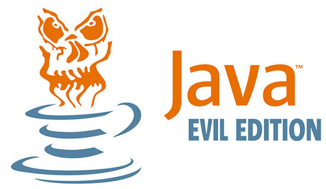

# JReFrameworker
A ReFrameworking tool for creating Managed Code Rootkits (MCRs) in the Java Runtime Environment

## Overview
This project aims to extend the work done by Erez Metula in his book [Managed Code Rootkits: Hooking into Runtime Environments](http://amzn.to/1LuFMaF). The work outlines a tool [ReFrameworker](https://appsec-labs.com/managed_code_rootkits/#Tool) that claims to be a framework modification tool capable of performing *any* modification task, however the tool falls short in usability for developing new functions as most users are not familiar with working in the intermediate representations (IR) required by the tool.  The current version of ReFrameworker (version 1.1) does not have the ability to manipulate Java byte code, although Erez Metula points out that the same techniques using IRs such as Jasmin can be used to create Java MCRs.

## JReFrameworker
This project aims to extend previous works by introducing JReFrameworker, a tool to extend MCR capabilities to the Java Runtime Environment in a user friendly and generic way.
